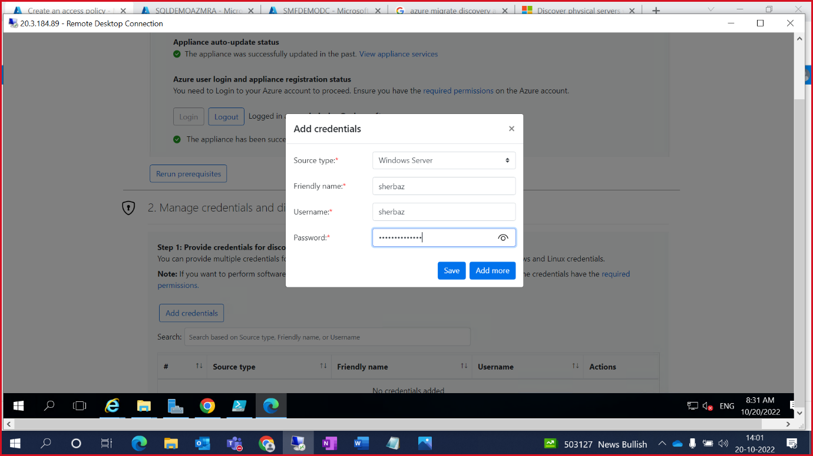

# Azure Migrate Application Dependency Mapping/Assessment

This lab provides step by step procedures to configure dependency analysis in **Azure Migrate: Discovery and assessment**.

Dependency analysis identifies dependencies between discovered on-premises servers. It provides these advantages:

- This lets us to gather servers into groups for assessment more accurately.
- Identification of servers that must be migrated together. This is especially useful if there are no data about app dependency.
- Analyzing dependencies helps ensure that nothing is left behind, and thus avoids surprise outages after migration.

## App Service Migration Assistant

### IIS Configuration

Before hosting any site on the WebServer(IIS), We need to activate the server role for the IIS and ASP.NET 4.7.

1. Open “Server Manager” and click on “Add roles and feature”.

    

2. Go to Server Roles by clicking on “Next” button.

3. Search for WebServer (IIS) and check the checkbox. Use “Add Features” button to add the feature.

    

4.	Click on “next” and then install.

    
    
    
    
5.	Reopen “Add Roles and Feature Wizard” by clicking on “Add roles and feature”. 

6.	Goto server role and Check the “ASP.NET 4.7” check box.

    

7.	Click on “next” and then install.

    

8.	Close the wizard.

> Note: VM Restart is not required.

Now we have activated the Server Role for the IIS and ASP.NET 4.7. Next, we will publish the website over the IIS.

1.	Open C drive and extract the adventure.zip file.

2.	Open the extracted folder and open web.config in notepad to edit.

3.	Replace the server name in the connection string with the Source Server IP or hostname.

    

4.	Open Run Window using “Ctrl + R“ and enter ‘inetmgr’ and press enter.

    

5.	This will open the IIS Manager.

6.	First we will delete the default website hosted on Port number 80 then host our website. Right click on the “Default Web Site” and delete.

7.	Right click on “Sites” and select Add Website.

    

8.	Provide the site name as “adventure”.

9.	Select the “Physical Path” as C:/adventure and use Port number 80.

    

10.	Add default document as “home.aspx”.

    

11.	Now Browse the application and check data.

## Create a project for the first time

Set up a new project in an Azure subscription -

1. In the Azure portal, search for **Azure Migrate**.

2. In Services , select **Azure Migrate**.

3. In Overview , select **Discover, assess, and migrate**.

    

4. In Servers, databases, and web apps , select **Create project**.

    

5. In Create project , select the **Azure subscription**, and **resource group**.

6. In Project Details , specify the **project name** as **adventureMigrate** and the **geography** in which you want to create the project.

    - The geography is only used to store the metadata gathered from on-premises servers. You can assess or migrate servers for any target region regardless of the selected geography.

7. Select **Create** to initiate Project deployment.

    

## Azure Migrate appliance – Agentless Migration:

Set up the appliance by with below steps:

1. In Azure Migrate Hub, under **Migration tools** select **Discover**.

    

2. In Discover page, select **Yes, with _Physical or other_**.

    

3. Under Name your appliance provide name as **SQLDISCOVERYAZ**.

    

4. Specify a _name to the appliance_ as shown below and click **Generate Key**.

    

5. Once Key has been generated, Right click on **Download** and copy link adress to get the OVA file link.

    

6. Open Source VM and open the link on Microsoft Edge. Now Go to **Downloads** folder on the VM and **unzip** the Azure migrate folder.

    

7. Run the **Azure migrate installer** PowerShell script as specified below.

    
    
    Enter 3 to select "Physical or other"
    
    
    
    Enter 1 to select "Azure Public"
    
    
    
    Enter 1 to select "Public Endpoint option"

    
    
8. Once setup is completed, go to Desktop to run the **Migrate Appliance configuration webpage**.

    

    
    
    
    
9. Now **Set up Prerequisites**.

    
    
    
    
10. Provide the **Appliance Key** that was generated on the Azure Portal and click **verify**.

    
    
    
    
    

11. Click **login** to authenticate with your lab Credentials.

    
    
    

    

    
    
12. Once Azure credentials are authenticated. Proceed adding **Domain credentials**.

    
    
    

13. Now **add discovery source**. Specify the IP address and the friendly name with given format.

    

14. **Verify** the input post adding the values.

    

15. If any validation fails, fix the error, and do **revalidate**.

    
        
    

16. Specify the **SQL credentials** for SQL DB discovery.

    

    
    
17. Now click **Start discovery** to initiate the discovery process.

    
    
    

## ASSESSMENT:

23. Click **create group** to Group the servers for assessment.

    

24. Provide **group name** and select the **discovered machines**. Click **create**.

    
    
    

25. Select **Create Assessment** and choose **Azure VM**.

    
    
    
    
26. Select the **Group** that was created earlier to perform the assessment on those servers.

    

27. Review and **create assessment**.

    
    
    

28. Go to **Azure Migrate Hub** overview page and select the **assessment** that has been populated.

    

29. Click on the **assessment report** that has been generated.

    

30. Click on the various options available assessment details blade to see **Azure Readiness & Cost details**.

    
    
    
    
    
    
## DEPENDANCY ANALYSIS:

When migrating a workload to Azure, it is important to understand all workload dependencies. A broken dependency could mean that the application doesn't run properly in Azure, perhaps in hard-to-detect ways. Some dependencies, such as those between application tiers, are obvious. Other dependencies, such as DNS lookups, Kerberos ticket validation or certificate revocation checks, are not.

In this task, you will configure the Azure Migrate dependency visualization feature. This requires you to first create a Log Analytics workspace, and then to deploy agents on the to-be-migrated VMs.

1. Return to the Azure Migrate blade in the Azure Portal, and select Servers databases and web apps. Under Azure Migrate: Discovery and assessment select Groups, then select the AdventureVMs group to see the group details. Note that each VM has their Dependencies status as Requires agent installation. Select Requires agent installation for the web1 VM.

2. On the Dependencies blade, select Configure OMS workspace.

