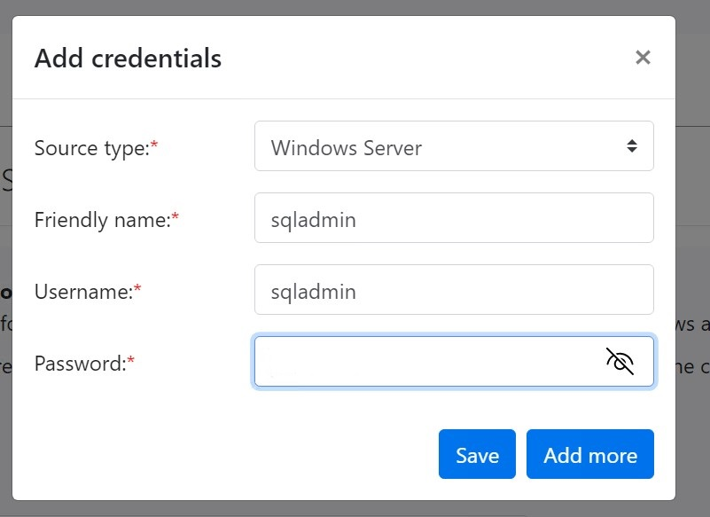
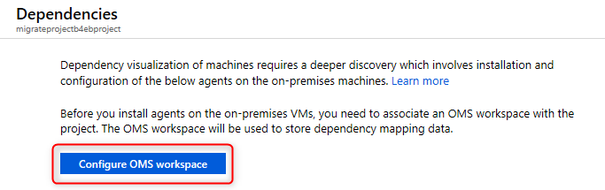

# Azure Migrate Application Dependency Mapping/Assessment

This lab provides step by step procedures to configure dependency analysis in **Azure Migrate: Discovery and assessment**.

**Dependency analysis** identifies dependencies between discovered on-premises servers. It provides these advantages:

- This lets us to gather servers into groups for assessment more accurately.
- Identification of servers that must be migrated together. This is especially useful if there are no data about app dependency.
- Analyzing dependencies helps ensure that nothing is left behind, and thus avoids surprise outages after migration.

## Abstract and learning objectives

In this hands-on lab, you will learn how to assess the servers and application. You will learn how to use Azure Migrate as the hub for discovery and assessement, together with accompanying tools.

## Overview

Before the lab, you will have pre-deployed an on-premises infrastructure hosted as Azure VMs.  This infrastructure is hosting a multi-tier application called **adventure**, using Azure VMs for each of the application tiers.

During the lab, you will migrate this entire application to Azure. This will include assessing the on-premises application using Azure Migrate and  assessing the database migration using Microsoft Data Migration Assistant (DMA)

## Solution architecture

   

The Adventure application comprises 3 VMs hosted in Azure:

- **Database tier** Hosted on the SourceSQLServer VM, which is running SQL Server 2019.

- **Web tier** Hosted on the WebServer1 and WebServer2 VM, which is running Windows Server 2019.

> Note:
> In the Deployed resource group, the VM that starts with 
> - **Source{XXXX}** will be reffered as **SourceSQLServer** in the lab
> - **WebServer1{XXXX}** will be reffered as **WebServer1** in the lab
> - **WebServer2{XXXX}** will be reffered as **WebServer2** in the lab

## Steps on how to connect to virtual machines via RDP

1. Go to **Azure portal** and click on hamburger button ☰ on top-left side and select **Resource groups**. Select the resource group deployed in the Azure Portal. Amongst the list of resources, open the **virtual machine** you want to connect to.

2. Click on **Connect** and then click **Select** to connect via native RDP. Click **Download RDP file** to download.

3. File will be downloaded inside **Downloads** folder in your local system. Open the RDP file. Then select **Connect**.

4. Click on **More choices** and then select **Use a different account**. Enter ```sqladmin``` as Email address and ```Password@123``` as Password. Click **Ok**. And Select **Yes** to verify the certificate.

5. Now you are inside the **virtual machine**.

## Steps on how to check Public IP Address and Hostname of VMs

1. Go to **Azure portal** and click on hamburger button ☰ on top-left side and select **Resource groups**. Select the resource group deployed in the Azure Portal. Amongst the list of resources, open the **virtual machine** you want to connect to.

2. Click on **Connect** and then copy **Public IP Address**.

3. Name of virtual machine is the **Hostname**.

     

## Configuring Web Application

A Web application(adventure) is hosted on WebServer1, where you need to modify config file for connecting to database.

Connect to Webserver1 as mentioned above, then follow below steps:

1.	Open ```C drive``` and open **adventure** folder.

2.	Open **web.config** in notepad to edit.

3.	Replace the **Source6uo4ez7vv** in both the connection strings with the **Public IP Address or hostname** of the SourceSQLServer.

    

4.	Open Run Window using **Ctrl + R** and enter **inetmgr** and press enter.

    

5.	This will open the **IIS Manager**.

6.	Now Browse the application and check data.

     
     
     

## Assess an application with Data Access Migration Toolkit

To enable this assessment, use the Data Access Migration Toolkit (DAMT), a Visual Studio Code extension. The latest version of this extension (v 0.2) adds support for .NET applications and T-SQL dialect.

1.	Search for **Visual studio code** in Search bar at the bottom and Open it.

    

2.	Now select on **Extensions Marketplace** on the left side and search for **Data Access Migration Toolkit** and Install it.

    
    
    

3.	Then click on **Explorer** and **Open Folder…** and go to C drive and select **AdventureWorks** folder.

    
    
    

4. Press **Ctrl+Shift+P** to start the extension console and then run the **Data Access: Analyze Workspace** command.

    

5. Select the **SQL Server** dialect.

    

At the end of the analysis, the command produces a report of SQL connectivity commands and queries.

6. Review the report for data connectivity components and for SQL queries embedded in the application code. These elements appear highlighted.

    

These queries can be analyzed through DMA for compatibility and feature parity issues based on the target SQL platform.

7. To assess the application's data layer, export the report in JSON format.

    

8. The generated file has these contents:

    

## Create a project in Azure Migrate

Set up a new project in an Azure subscription -

1. Go back to your local machine, in **Azure portal**, search for **Azure Migrate**.

2. In Services , select **Azure Migrate**.

3. In Overview , select **Discover, assess, and migrate**.

    

4. In Servers, databases, and web apps , select **Create project**.

    

5. In Create project , select the **Azure subscription**, and **resource group**.

6. In Project Details , specify the **project name** as **adventureMigrate** and the **geography** in which you want to create the project.

    - The geography is only used to store the metadata gathered from on-premises servers. You can assess or migrate servers for any target region regardless of the selected geography.

7. Select **Create** to initiate Project deployment.

    

## Azure Migrate appliance:

Set up the appliance by with below steps:

1. In Azure Migrate Hub, under **Migration tools** select **Discover**.

    

2. In Discover page, select **Yes, with _Physical or other_**.

    

3. Under Name your appliance provide name as **SQLDISCOVERYAZ**.

    

4. Specify a _name to the appliance_ as shown below and click **Generate Key**.

    

5. Once Key has been generated, Right click on **Download** and copy link adress to get the OVA file link.

    

6. Open **SourceSQLServer** VM and open the link on Microsoft Edge. The OVA file will be downloaded. Now Go to **Downloads** folder on the VM and **unzip** the Azure migrate folder.

    

7. Run the **Azure migrate installer** PowerShell(As Administrator ) script as specified below.

    
    
    Enter ```3``` to select **Physical or other**
    
    
    
    Enter ```1``` to select **Azure Public**
    
    
    
    Enter ```1``` to select **Public Endpoint option** and then Enter ```Y``` to continue

    
    
    Enter ```N``` to continue

    
    
8. Once setup is completed, go to Desktop to run the **Azure Migrate Appliance configuration**.

    

    
    
    
    
9. Now **Set up Prerequisites**.

    
    
    
    
10. Provide the **Appliance Key** that was generated on the Azure Portal and click **verify**.

    
    
    
    
    

11. Click **login** to authenticate with your lab Credentials.

    
    
    

    

    Provide your Username and Password to complete the login process and then continue.
    
    
    
12. Once Azure credentials are authenticated. Proceed adding **Domain credentials**.

    
    
    Enter Friendly name as **sqladmin**, Username as **sqladmin** and Password as **Password@123**
    
    

13. Now **add discovery source**. Specify the hostname of the SourceSQL Server and the friendly name (sqladmin) with given format.

    

14. Add ```WebServer1``` and ```WebServer2``` similarily as discovery source

    

15. If any validation fails, fix the error, and do **revalidate**.

16. Specify the **SQL credentials** for SQL DB discovery. Enter Friendly name as **sqladminAuth**, Username as **sqladmin** and Password as **Password@123**

    
   
17. Now click **Start discovery** to initiate the discovery process.

    
    
    


## ASSESSMENT:

In this task, you will use Azure Migrate to create a migration assessment for the Adventure application, using the data gathered during the discovery phase.

1. Go Back to **Azure Portal** in your local machine to open Azure Migrate, Goto **Discover,access and migrate**. Click on **Discovered Server Count**.

    
    
2. Click **create group** to Group the servers for assessment.
 
    

3. Provide group name as **adventureGroup** and select the **discovered machines**. Click **create**.

    

4. Select **Create Assessment** and choose **Azure VM**.

    
    
    
    
5. Select the **Group** that was created earlier to perform the assessment on those servers.

    

6. Review and **create assessment**.

    
    
    

7. Go to **Azure Migrate Hub** overview page and select the **assessment** that has been populated.

    

8. Click on the **assessment report** that has been generated.

    

9. Click on the various options available assessment details blade to see **Azure Readiness & Cost details**.

   
   
   
   
   
    
## DEPENDENCY ANALYSIS:

When migrating a workload to Azure, it is important to understand all workload dependencies. A broken dependency could mean that the application doesn't run properly in Azure, perhaps in hard-to-detect ways. Some dependencies, such as those between application tiers, are obvious. Other dependencies, such as DNS lookups, Kerberos ticket validation or certificate revocation checks, are not.

In this task, you will configure the Azure Migrate dependency visualization feature. This requires you to first create a Log Analytics workspace, and then to deploy agents on the to-be-migrated VMs.

1. Return to the Azure Migrate blade in the Azure Portal, and select **Servers databases and web apps**. Under **Azure Migrate: Discovery and assessment** select **Groups**, then select the **AdventureVMs** group to see the group details. Note that each VM has their Dependencies status as Requires agent installation. Select Requires agent installation for the webserver1 VM.
    
    
    
2. On the Dependencies blade, select **Configure OMS workspace**.
    
    
    
3. Create a new **OMS workspace**. Use ```AzureMigrateWS``` as the workspace name with is a random number, lets take 98. Choose a workspace location close to your lab deployment, then select **Configure**.
    
    
    
4. Wait for the **Log Analytics workspace** to be deployed. Once it is deployed, navigate to it, and select **Agents** under Settings on the left. Make a note of the **Workspace ID** and **Primary Key** by copying into notepad.
    
    
    
5. Return to the **Azure Migrate Dependencies** blade. Copy each of the 2 agent download URLs and paste them alongside the Workspace ID and key you noted in the previous step.
    
    
    
6. Connect to the **Webserver1** vm and Open Edge, and paste the link of the 64-bit Microsoft Monitoring Agent for Windows, which you noted earlier. When prompted, Run the installer. First you need to unistall.
Note : Machine Restart is NOT required.
   
   
    
   Re-launch the installer.
   
   
    
7. Select through the installation wizard until you get to the Agent Setup Options page. From there, select Connect the agent to **Azure Log Analytics (OMS)** and select **Next**. Enter the **Workspace ID** and **Workspace Key** that you copied earlier, and select **Azure Commercial** from the Azure Cloud drop-down. Select through the remaining pages and install the agent.
    
    
    
    
    
8. Now paste the link to the **Dependency Agent Windows installer** into the browser address bar. Run the installer and select through the install wizard to complete the installation.
    
    
    
Connect to the **SourceSQLServer** and **webserver2** VM and repeat the installation process (steps 6-8) for both agents.

The agent installation is now complete. Next, you need to generate some traffic on the hosted application so the dependency visualization has some data to work with. Browse to the public IP address of the webserver1 server, and spend a few minutes refreshing the page.

## Explore dependency visualization

In this task, you will explore the dependency visualization feature of Azure Migrate. This feature uses data gathered by the dependency agent you installed in above task.

1. Return to the **Azure Portal** and refresh the Azure Migrate adventureGroup VMs group blade. The 3 VMs on which the dependency agent was installed should now show their status as ```Installed```. (If not, refresh the page using the browser refresh button, not the refresh button in the blade. It may take up to 5 minutes after installation for the status to be updated.)

    

2. Select **View dependencies**.

    

3. Take a few minutes to explore the dependencies view. Expand each server to show the processes running on that server. Select a process to see process information. See which connections each server makes.

    

In this exercise, you used Azure Migrate to assess the on-premises environment. This included selecting Azure Migrate tools, deploying the Azure Migrate appliance into the on-premises environment, creating a migration assessment, and using the Azure Migrate dependency visualization.

If a customer has a clear list of servers for migration and the customer requirement is only to move the Vms (Lift and shift) to IaaS then, **Azure Migrate** can be considered, it covers Hyper-V, VMware, and physical servers. However, discuss and define with the customer which platform will be assessed.

If a customer has a clear list of servers for migration and the customer requirement is to modernize the databases with target minimal landing SKUs options then **DMA assessment** can be considered which is explained further in the lab.

After all the Assessment and Dependency visualization next you can proceed with Actual lift and shift of server using the Azure Migrate. For details please go thorugh below link :

https://learn.microsoft.com/en-us/azure/migrate/migrate-services-overview

## App Service Migration Assistant (ASMA) Tool

If you need to migrate only the application then you can use app service migration tool. Next excercise will go through the steps :

1. Download and install **AppServiceMigrationAssistant** using below link on WebServer1 

    https://azure.microsoft.com/en-au/services/app-service/migration-assistant/thank-you/?download=windows

2. Open the **AppServiceMigrationAssistant** using shortcut present on Desktop. Select the **hosted site** and click on **next**.

    

3. Check the **report** and resolve errors if any. Click on **next**.

    

4. Click on **copy code and open browser** and **login**.

    

5. Go back to the **App Service Migration Assistant** and select the **Azure Migrate Project** which was created before .

    

6. Select Subscription, use existing Resource group, and Provide site name as ```adventureweb```.
   > Note: If you get an error message that site name is already taken then use an unique name and proceed.
    
    
    

7. Select **Create new** in App service plan and no other changes. Click on **Migrate**.
    
    
    
    
    
8. After Migration is completed, Select **Automatically install and complete HCM setup on this server** and download the setup using link provided and complete the installation.

    
    
    
    
9. Click next after installation to see the Migration Result. Click on **Go to your website** to view the migrated site.
    
    
     
    
    
## Exercise summary

In this exercise you migrated the web tier of the application from on-premises to Azure using Azure Migrate. Completed prerequisites to migrate the virtual machines, you reconfigured the application tier to use the migrated application database hosted in Azure SQL Database, and verified that the migrated application is working end-to-end. You also installed the VM Agent on the migrated virtual machines and explored the dependency mapping.
