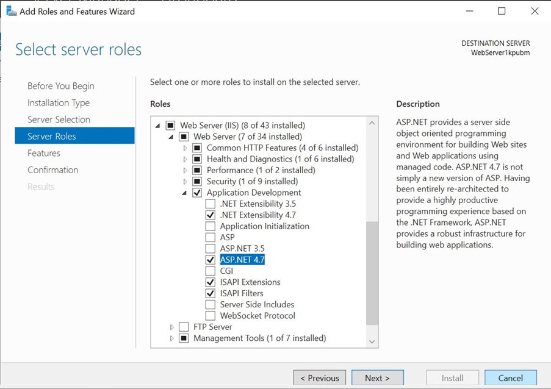
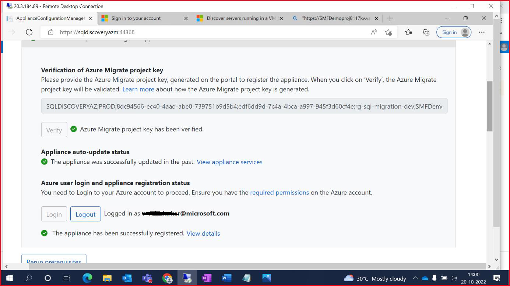
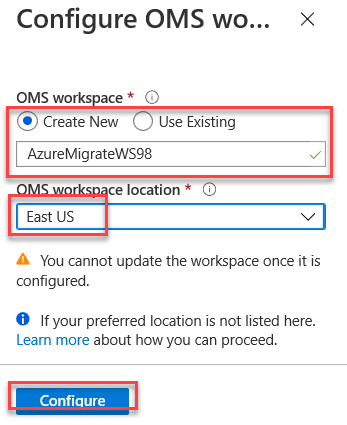
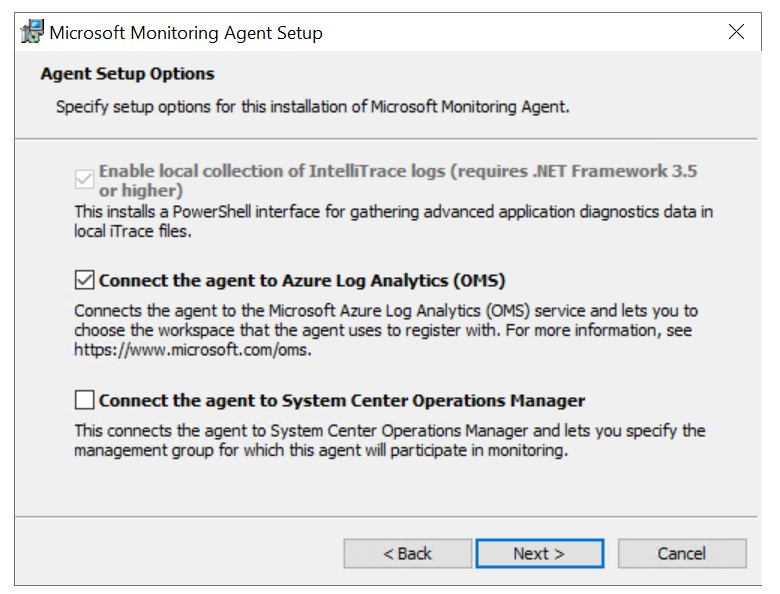
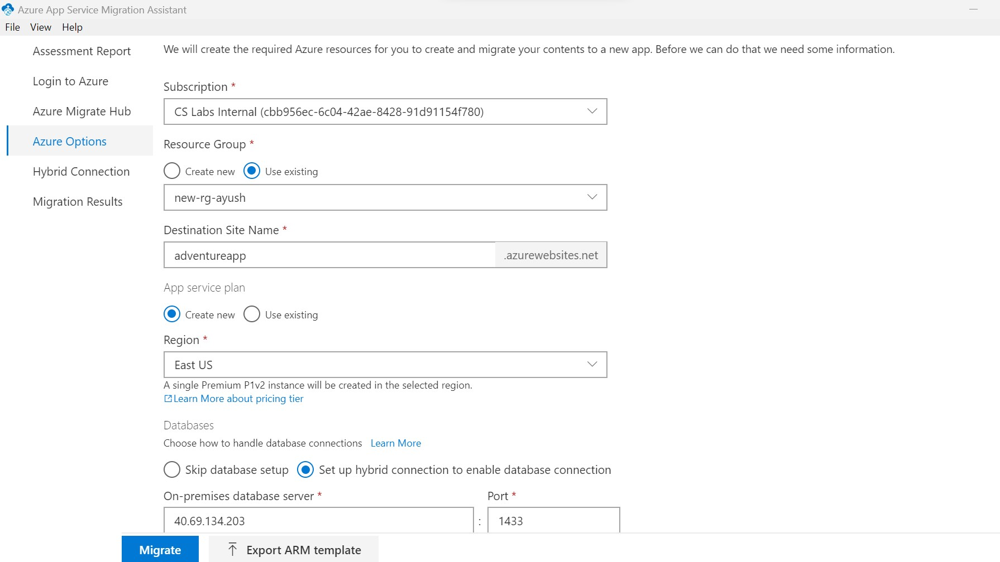

# Azure Migrate Application Dependency Mapping/Assessment

This lab provides step by step procedures to configure dependency analysis in **Azure Migrate: Discovery and assessment**.

Dependency analysis identifies dependencies between discovered on-premises servers. It provides these advantages:

- This lets us to gather servers into groups for assessment more accurately.
- Identification of servers that must be migrated together. This is especially useful if there are no data about app dependency.
- Analyzing dependencies helps ensure that nothing is left behind, and thus avoids surprise outages after migration.

## Hosting Web Application

## Connecting to application server virtual machine via RDP

1. Go to **Azure portal** and click on hamburger button ☰ on top-left side and select **Resource groups**. Select the resource group deployed in the Azure Portal. Amongst the list of resources, open the **virtual machine** .

2. Click on **Connect** and then click **Select** to connect via native RDP. Click **Download RDP file** to download.

3. File will be downloaded inside **Downloads** folder in your local system. Open the RDP file. Then select **Connect**.

4. Click on **More choices** and then select **Use a different account**. Enter ```sqladmin``` as Email address and ```Mail@123``` as Password. Click **Ok**. And Select **Yes** to verify the certificate.

5. Now you are inside the **virtual machine**.

### IIS Configuration

Before hosting any site on the WebServer(IIS), We need to activate the **server** role for the IIS and ASP.NET 4.7.

Connect Webserver1 as mentions above and follow below steps :

1. Inside server, Open **Server Manager** and click on **Add roles and feature**.

    

2. Go to Server Roles by clicking on **Next** button.

3. Search for **WebServer (IIS)** and check the checkbox. Use **Add Features** button to add the feature.

    

4.	Click on **next** and then **install**.

    
    
    
    
5.	Reopen **Add Roles and Feature Wizard** by clicking on **Add roles and feature**. 

6.	Go to server role and Check the **ASP.NET 4.7** check box.

    

7.	Click on **next** and then **install**.

    

8.	Close the wizard.

> Note: VM Restart is not required.

### Hosting Application

Now we have activated the Server Role for the IIS and ASP.NET 4.7. Next, we will publish the website over the IIS.

1.	Open ```C drive``` and extract the **adventure.zip** file.

2.	Open the extracted folder and open **web.config** in notepad to edit.

3.	Replace the **server name** in the connection string with the **Source Server IP or hostname**.

    

4.	Open Run Window using **Ctrl + R** and enter **inetmgr** and press enter.

    

5.	This will open the **IIS Manager**.

6.	First we will delete the default website hosted on Port number 80 then host our website. Right click on the **Default Web Site** and remove.

    

7.	Right click on **Sites** and select **Add Website**.

    

8.	Provide the site name as ```adventure```.

9.	Select the **Physical Path** as ```C:/adventure``` and use Port number ```80```.

    

10.	Add default document as **home.aspx**.

    
    

11.	Now Browse the application and check data.

     

## Create a project in Azure Migrate

Set up a new project in an Azure subscription -

1. In the Azure portal, search for **Azure Migrate**.

2. In Services , select **Azure Migrate**.

3. In Overview , select **Discover, assess, and migrate**.

    

4. In Servers, databases, and web apps , select **Create project**.

    

5. In Create project , select the **Azure subscription**, and **resource group**.

6. In Project Details , specify the **project name** as **adventureMigrate** and the **geography** in which you want to create the project.

    - The geography is only used to store the metadata gathered from on-premises servers. You can assess or migrate servers for any target region regardless of the selected geography.

7. Select **Create** to initiate Project deployment.

    

## Azure Migrate appliance:

Set up the appliance by with below steps:

1. In Azure Migrate Hub, under **Migration tools** select **Discover**.

    

2. In Discover page, select **Yes, with _Physical or other_**.

    

3. Under Name your appliance provide name as **SQLDISCOVERYAZ**.

    

4. Specify a _name to the appliance_ as shown below and click **Generate Key**.

    

5. Once Key has been generated, Right click on **Download** and copy link adress to get the OVA file link.

    

6. Open Source VM and open the link on Microsoft Edge. Now Go to **Downloads** folder on the VM and **unzip** the Azure migrate folder.

    

7. Run the **Azure migrate installer** PowerShell(As Administrator ) script as specified below.

    
    
    Enter 3 to select "Physical or other"
    
    
    
    Enter 1 to select "Azure Public"
    
    
    
    Enter 1 to select "Public Endpoint option"

    
    
    Enter N to continue

    
    
8. Once setup is completed, go to Desktop to run the **Migrate Appliance configuration webpage**.

    

    
    
    
    
9. Now **Set up Prerequisites**.

    
    
    
    
10. Provide the **Appliance Key** that was generated on the Azure Portal and click **verify**.

    
    
    
    
    

11. Click **login** to authenticate with your lab Credentials.

    
    
    

    

    
    
12. Once Azure credentials are authenticated. Proceed adding **Domain credentials**.

    
    
    

13. Now **add discovery source**. Specify the IP address and the friendly name with given format.

    

14. Add WebServer1 and WebServer2 similarily as discovery source

    

15. If any validation fails, fix the error, and do **revalidate**.

16. Specify the **SQL credentials** for SQL DB discovery.

    
   
17. Now click **Start discovery** to initiate the discovery process.

    
    
    


## ASSESSMENT:

23. Click **create group** to Group the servers for assessment.

    

24. Provide **group name** and select the **discovered machines**. Click **create**.

    
    
    

25. Select **Create Assessment** and choose **Azure VM**.

    
    
    
    
26. Select the **Group** that was created earlier to perform the assessment on those servers.

    

27. Review and **create assessment**.

    
    
    

28. Go to **Azure Migrate Hub** overview page and select the **assessment** that has been populated.

    

29. Click on the **assessment report** that has been generated.

    

30. Click on the various options available assessment details blade to see **Azure Readiness & Cost details**.

    
    
    
    
    
    
DEPENDANCY ANALYSIS:


When migrating a workload to Azure, it is important to understand all workload dependencies. A broken dependency could mean that the application doesn't run properly in Azure, perhaps in hard-to-detect ways. Some dependencies, such as those between application tiers, are obvious. Other dependencies, such as DNS lookups, Kerberos ticket validation or certificate revocation checks, are not.

In this task, you will configure the Azure Migrate dependency visualization feature. This requires you to first create a Log Analytics workspace, and then to deploy agents on the to-be-migrated VMs.

1. Return to the Azure Migrate blade in the Azure Portal, and select Servers databases and web apps. Under Azure Migrate: Discovery and assessment select Groups, then select the AdventureVMs group to see the group details. Note that each VM has their Dependencies status as Requires agent installation. Select Requires agent installation for the web1 VM.
    
    
    
2. On the Dependencies blade, select Configure OMS workspace.
    
    
    
3. Create a new OMS workspace. Use AzureMigrateWS as the workspace name, where is a random number. Choose a workspace location close to your lab deployment, then select Configure.
    
    
    
4. Wait for the Log Analytics workspace to be deployed. Once it is deployed, navigate to it, and select Agents under Settings on the left. Make a note of the Workspace ID and Primary Key (for example by using Notepad).
    
    
    
5. Return to the Azure Migrate 'Dependencies' blade. Copy each of the 2 agent download URLs and paste them alongside the Workspace ID and key you noted in the previous step.
    
    
    
6. Connect to the Web server1 and Open Edge, and paste the link to the 64-bit Microsoft Monitoring Agent for Windows, which you noted earlier. When prompted, Run the installer. First you need to unistall.
Note : Machine Restart is NOT required.
   
   
    
Re launch the installer 
   
   
    
7. Select through the installation wizard until you get to the Agent Setup Options page. From there, select Connect the agent to Azure Log Analytics (OMS) and select Next. Enter the Workspace ID and Workspace Key that you copied earlier, and select Azure Commercial from the Azure Cloud drop-down. Select through the remaining pages and install the agent.
    
    
    
    
    
8. Now paste the link to the Dependency Agent Windows installer into the browser address bar. Run the installer and select through the install wizard to complete the installation.
    
    
    
Connect to the SQL and web2 VM and repeat the installation process (steps 6-8) for both agents.

The agent installation is now complete. Next, you need to generate some traffic on the hosted application so the dependency visualization has some data to work with. Browse to the public IP address of the Web1 server, and spend a few minutes refreshing the page.

####Explore dependency visualization

In this task, you will explore the dependency visualization feature of Azure Migrate. This feature uses data gathered by the dependency agent you installed in above task.

1. Return to the Azure Portal and refresh the Azure Migrate adventureGroup VMs group blade. The 3 VMs on which the dependency agent was installed should now show their status as 'Installed'. (If not, refresh the page using the browser refresh button, not the refresh button in the blade. It may take up to 5 minutes after installation for the status to be updated.)

    

2. Select View dependencies.

    

3. Take a few minutes to explore the dependencies view. Expand each server to show the processes running on that server. Select a process to see process information. See which connections each server makes.

    

In this exercise, you used Azure Migrate to assess the on-premises environment. This included selecting Azure Migrate tools, deploying the Azure Migrate appliance into the on-premises environment, creating a migration assessment, and using the Azure Migrate dependency visualization.

Next you can proceed with Actual lift and sift of server using the Azure Migrate. For details please go thorugh below link :

If you need to migrate only the application then you can use app service migration tool. Next excercise will go through the steps :

1. Download and install AppServiceMigrationAssistant using below link on WebServer1 

https://azure.microsoft.com/en-au/services/app-service/migration-assistant/thank-you/?download=windows

2. Open the AppServiceMigrationAssistant using shortcut present on Desktop. Select the hosted site and click on next.

    

3. Check the report and resolved errors if any. Click on next

    

4. Click on “copy code and open browser” and login.

    

5. Go back to the App Service Migration Assistant and select the Azure Migrate Project () which was created before .

    

6. Select Subscription, Use existing Resource group, and Provide site name as “adventureweb”

    

7. Select “Create new” in App service plan and no other changes. Click on Migrate.
    
    
    
    
8. Select "Automatically install and complete HCM setup on this server" and download the setup using link provided and complete the installation.

    
    
    
9. Click next after installation to see the Migration Result. Click on "Go to your website" to view the migrated site.
    
     
     
    
