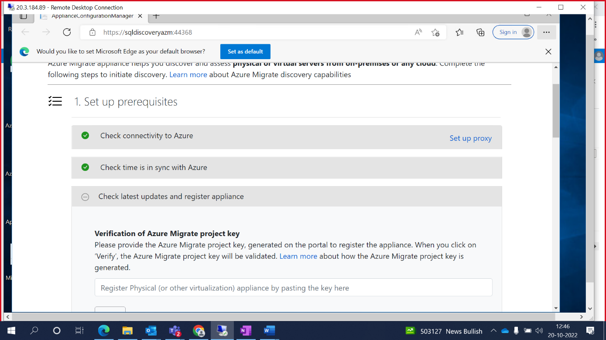
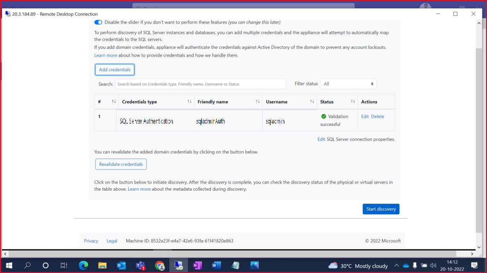

# Azure Migrate Application Dependency Mapping/Assessment

This lab provides step by step procedures to configure dependency analysis in **Azure Migrate: Discovery and assessment**.

Dependency analysis identifies dependencies between discovered on-premises servers. It provides these advantages:

- This lets us to gather servers into groups for assessment more accurately.
- Identification of servers that must be migrated together. This is especially useful if there are no data about app dependency.
- Analyzing dependencies helps ensure that nothing is left behind, and thus avoids surprise outages after migration.

## Create a project for the first time

Set up a new project in an Azure subscription -

1. In the Azure portal, search for **Azure Migrate**.

2. In Services , select **Azure Migrate**.

3. In Overview , select **Discover, assess, and migrate**.

    

4. In Servers, databases, and web apps , select **Create project**.

    

5. In Create project , select the **Azure subscription**, and **resource group**.

6. In Project Details , specify the **project name** and the **geography** in which you want to create the project.

    - The geography is only used to store the metadata gathered from on-premises servers. You can assess or migrate servers for any target region regardless of the selected geography.

7. Select **Create** to initiate Project deployment.

    

## Azure Migrate appliance – Agentless Migration:

Set up the appliance by with below steps:

1. In Azure Migrate Hub, under **Migration tools** select **Discover**.

    

2. In Discover page, select **Yes, with _Physical or other_**.

    

3. Under _How do you want to replicate?_ Select **Using agentless replication**.

    

4. Specify a _name to the appliance_ as shown below and click **Generate Key**.

    

5. Once Key has been generated, click **Download** to get the OVA file.

    

6. Go to **Downloads** folder on the VM and **unzip** the Azure migrate folder.

    

7. Run the **Azure migrate installer** PowerShell script as specified below.

    
    
    
    
    

    
    
8. Once setup is completed, go to Desktop to run the **Migrate Appliance configuration webpage**.

    

    
    
    
    
9. Now **Set up Prerequisites**.

    
    
    
    
10. Provide the **Appliance Key** that was generated on the Azure Portal and click **verify**.

    
    
    
    
    

11. Click **login** to authenticate with your lab Credentials.

    
    
    

    

    
    
12. Once Azure credentials are authenticated. Proceed adding **Domain credentials**.

    
    
    

13. Now **add discovery source**. Specify the IP address and the friendly name with given format.

    

14. **Verify** the input post adding the values.

    

15. If any validation fails, fix the error, and do **revalidate**.

    
        
    

16. Specify the **SQL credentials** for SQL DB discovery.

    

    
    
17. Now click **Start discovery** to initiate the discovery process.

    
    
    

## DEPENDANCY ANALYSIS:

18. Go back to Discovered server in Azure Migrate Hub, to enable the dependency mapping.

    

    
    
19. Click on **Dependency analysis** and select **Add servers**.

    

20. Select the **servers** that needs dependency mapping to initiate the analysis.

    

    

21. Once servers are added to analysis, you can now see option to **view dependencies**.

    

22. Click on each server to view respective dependency analysis.

    

#### SAMPLE MAPPING VIEW:

   
    
   
    
   

## ASSESSMENT:

23. Click **create group** to Group the servers for assessment.

    

24. Provide **group name** and select the **discovered machines**. Click **create**.

    
    
    

25. Select **Create Assessment** and choose **Azure VM**.

    
    
    
    
26. Select the **Group** that was created earlier to perform the assessment on those servers.

    

27. Review and **create assessment**.

    
    
    

28. Go to **Azure Migrate Hub** overview page and select the **assessment** that has been populated.

    

29. Click on the **assessment report** that has been generated.

    

30. Click on the various options available assessment details blade to see **Azure Readiness & Cost details**.

    
    
    
    
    
    
31. Click **Export Assessment** to download the XLSX version.

    
    
    
    
    

