# DMA Assessment

## DMA Assessments to migrate to Azure SQL Database(s)

   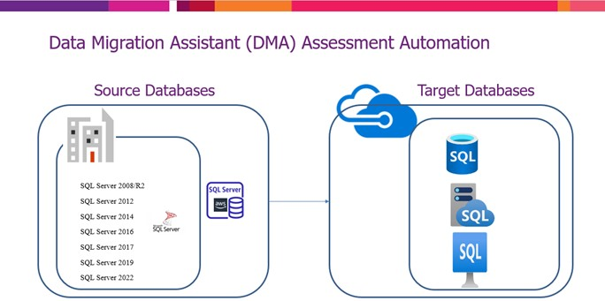

## Learning Objectives

This lab step is to provide the detailed procedure/step to use the **Data Migration Assistant (DMA)** automation script (```SMF_DMAPreReqAssessCombo_V5.8.ps1```) to detect/assess the following issues in on-premise SQL Servers:

- Migration blocking issues: 
    - To discover the compatibility issues that block migrating on-premises SQL Server database(s) to Azure SQL Database
    - To discover the compatibility issues that block migrating on-premises SQL Server database(s) to Azure SQL Managed Instance
    - To discover the compatibility issues that block migrating on-premises SQL Server database(s) to SQL Server on Azure Virtual Machines 
- And to initiate & terminate the data-collection process for the target SKU assessment.

## Prerequisites for DMA Assessment

- Virtual Machine - Already setup for you.
- Software & PowerShell module:
    - .NET Core 3.1.28
    - .NET Framework 4.8
    - Microsoft® Data Migration Assistant v5.6
    - ImportExcel  
- Input Excel File - The DMA automation script is based on the worksheet named ‘DMA-INPUT-FILE.xlsx’ and following columns in worksheet of the Input Excel file:

Column Name | Note
------------- | -------------
Computer Name | SQL Server Name (e.g. 01SQLDEV001)
SQL Server Instance Name | SQL Server Instance Name (e.g. MSSQLSERVER)
SQL Server Product Name | SQL Server Product Name (e.g. Microsoft SQL Server 2016)
Authentication type | Authentication type (e.g. either Windows Authentication or SQL Server Authentication)
DBUserName | Database User Name (e.g. sa) in case of SQL Server Authentication. User must be member of the SQL Server sysadmin role
DBPassword | Database User Password (e.g. Password123) in case of SQL Server Authentication
DBPort | Database Port (e.g. 1433)

## Exercise 1: Connecting to virtual machine via RDP

1. Go to **Azure portal** and click on hamburger button ☰ on top-left side and select **Resource groups**. Select the resource group deployed in the Azure Portal. Amongst the list of resources, open the **virtual machine** starting with name ```Target{*}```.

    
    
    
    
    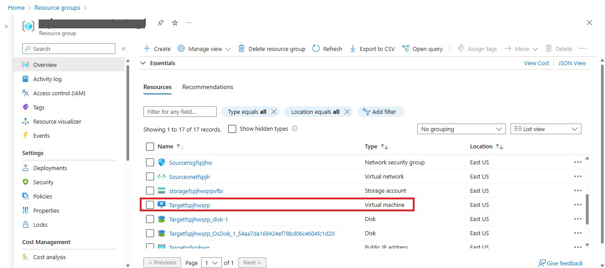

2. Click on **Connect** and then click **Select** to connect via native RDP. Click **Download RDP file** to download.

    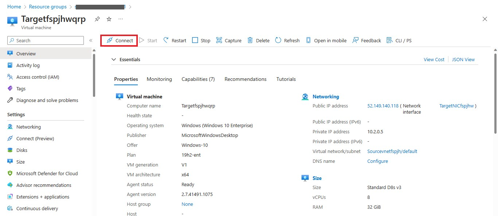
    
    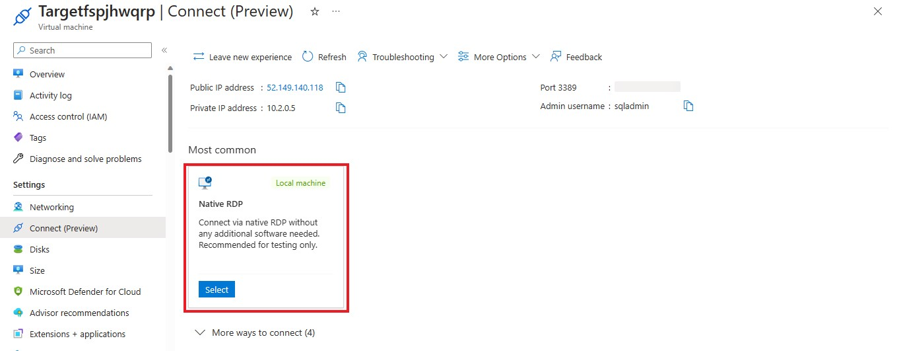
    
    

3. File will be downloaded inside **Downloads** folder in your local system. Open the RDP file. Then select **Connect**.

    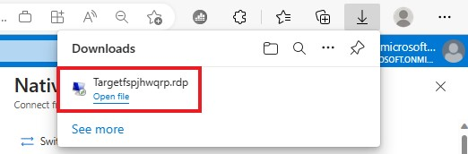
    
    

4. Click on **More choices** and then select **Use a different account**. Enter ```sqladmin``` as Email address and ```Mail@123``` as Password. Click **Ok**. And Select **Yes** to verify the certificate.
    
    
    
    
    
    
    
    

5. Now you are inside the **virtual machine**.

    

## Exercise 2: Copying powershell scripts and input excel file for DMA assessment

1. Click on **File Explorer** present in Taskbar at the bottom. Go to ```C:\Packages\Plugins\Microsoft.Compute.CustomScriptExtension\1.10.15\Downloads\0``` path. This folder contains ```DMA-INPUT-FILE.xlsx```, ```SMF_DMAPreReqAssessCombo_V5.8.ps1``` and ```Terminate.ps1``` files.

    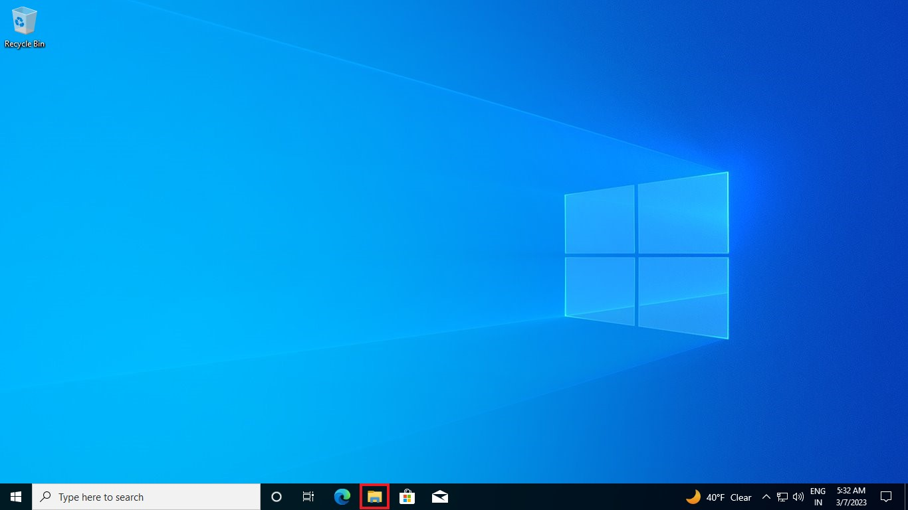
    
    
    
    

2. Select these files and right-click on the mouse and select **Copy** or press **Ctrl + C**.

    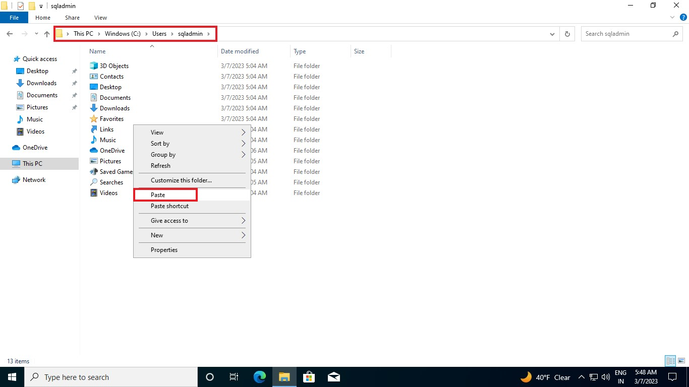

3. Now go to ```C:\Users\sqladmin``` path and right-click on the mouse and select **Paste** or press **Ctrl + V** to paste the files in this folder.

    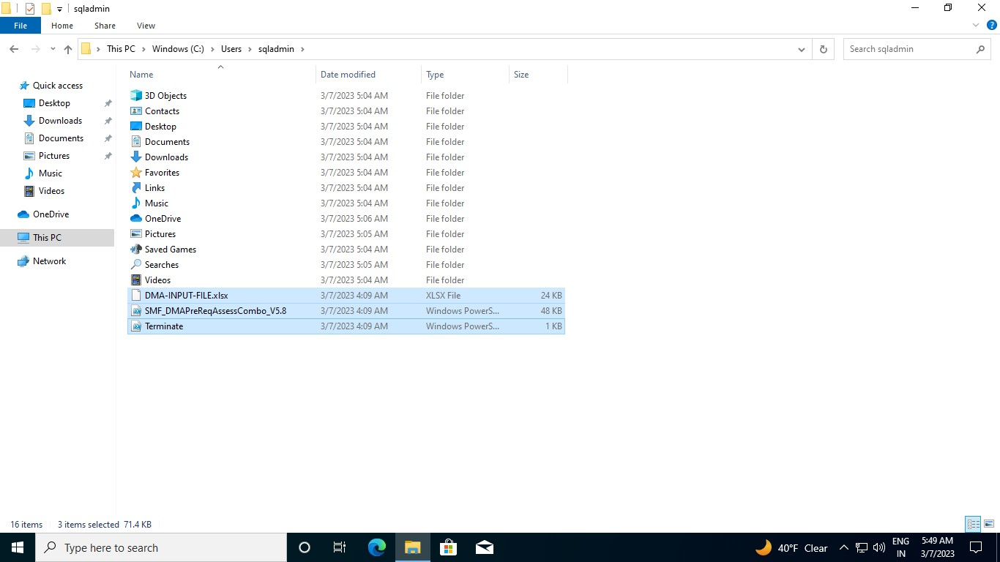
    
    
    
## Exercise 3: Preparing the Input excel file

1. Search for ```Office``` in the **Search bar** at the bottom and click **Open**.

    

2. Click **Sign in** and sign into **MS office** using your lab credentials.

    

3. Select **Excel** and then click **Upload and open...** option. Browse to ```C:\Users\sqladmin``` path and select ```DMA-INPUT-FILE.xlsx``` file and select **Open**. It will be opened in the Microsoft Edge browser.

    
    
    

4. This is the sample input file. You need to edit the contents of the excel file ```Computer Name```, ```DBUserName``` and ```DBPassword``` columns and make sure other columns are correct. 

    

5. Replace ```testuser``` with  ```sqladmin``` in **DBUserName** column and replace```12345``` with  ```Mail@123``` in **DBPassword** column. Ensure that Database User Name and Password are correct and can connect to SQL Server instance to be assessed in case of SQL Server Authentication.

    

6. To get the **Computer name**, go back to the azure portal opened in your local machine and inside resource group, copy the virtual machine name starting with ```Source{*}```. And switch back to virtual machine and paste it in the excel replacing **localhost**. Ensure the Computer Names are correct and connectivity exists between the virtual machine which runs the DMA assessment and Computer Name provided in the column.

    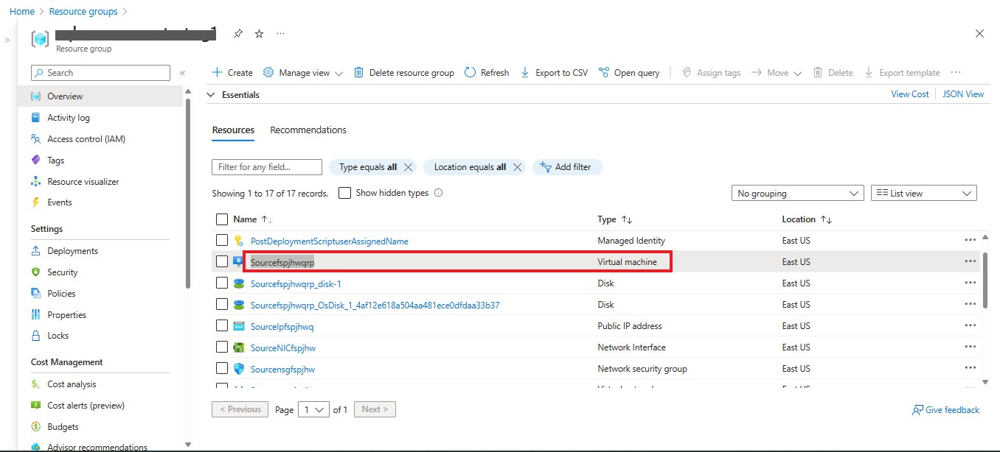
    
    

7. Ensure the **SQL SERVER Product Name** is one of the below given values:
   - Microsoft SQL Server 2022
   - Microsoft SQL Server 2019
   - Microsoft SQL Server 2017
   - Microsoft SQL Server 2016
   - Microsoft SQL Server 2014
   - Microsoft SQL Server 2012
   - Microsoft SQL Server 2008

    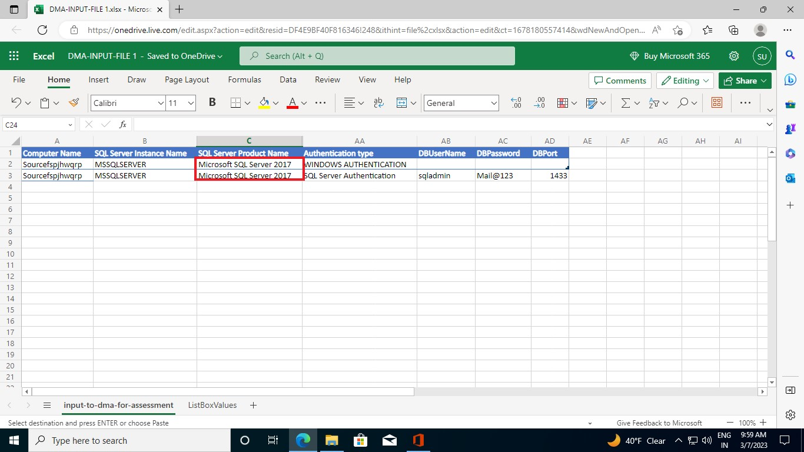
 
8. Ensure that **Authentication type** is either **Windows Authentication** or **SQL Server Authentication**.

    

9. Ensure Database ports are correct and can connect to SQL Server instance with this port. 

    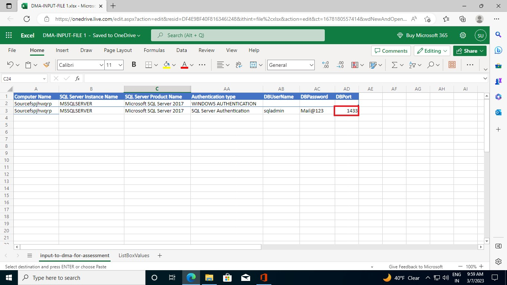

10. Once the input file is prepared, Select **File** at top-left side and then **Save As** and click **Download a copy**. 

    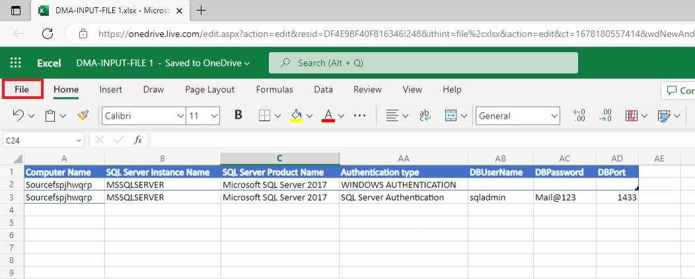
    
    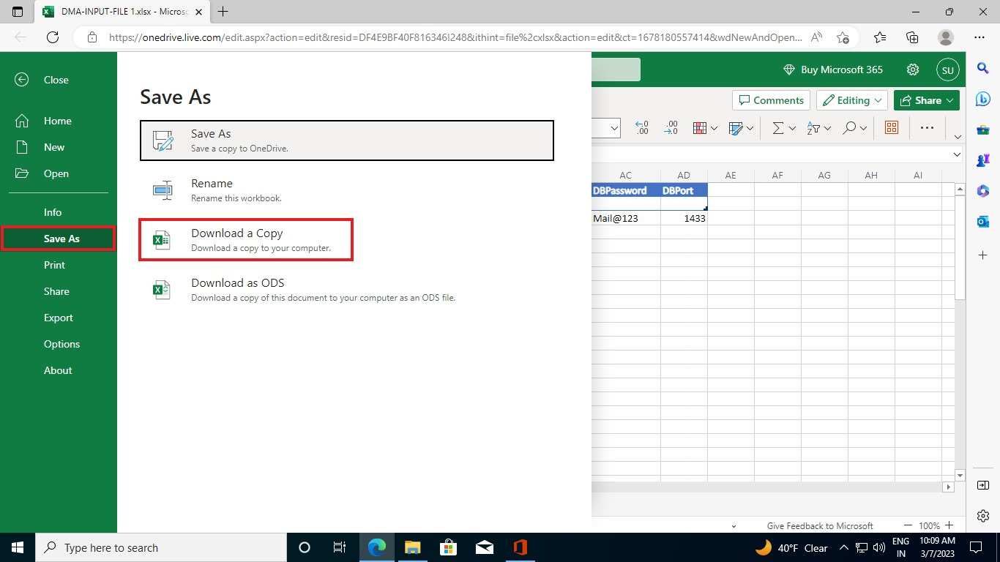

11. Open **File explorer** and Go to **Downloads** folder and select ```DMA-INPUT-FILE.xlsx``` file and right-click on the mouse and select **Copy** or press **Ctrl + C**. Now go to ```C:\Users\sqladmin``` path and right-click on the mouse and select **Paste** or press **Ctrl + V** to replace the existing file. Please make sure that the file name should not be changed.

    
    
    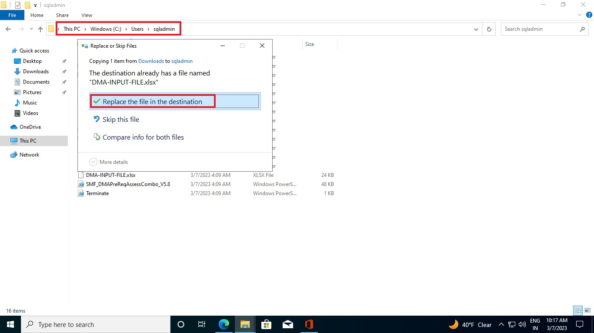

## Exercise 4: Runing DMA assessment powershell script

1. In ```C:\Users\sqladmin``` path, right-click on ```SMF_DMAPreReqAssessCombo_V5.8.ps1``` script and select **Run with PowerShell** to run the script.

    

2. Now **Windows powershell** will open and ask for your input.

    

3. Give ```2``` as input value and hit enter to perform DMA Assessment. After triggering the automation all the support folders( Archive , output , Downloads etc. ) will be created automatically by the automation script in the ```C:\Users\sqladmin``` folder. 

    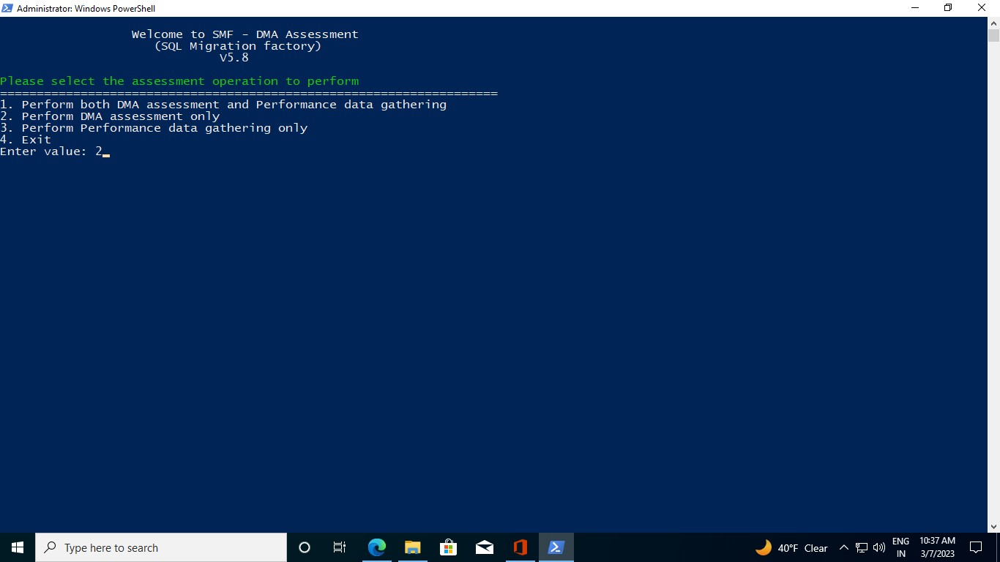
    
    
    
> Note: .Net 4.8, .Net Core, DMA and ImportExcel PS module are required for this assessment.  

4. **.Net 4.8** is already available in the virtual machine. So, it will ask for your input to install **DMA**. Enter ```Y``` to download & install the DMA 5.6.

    

5. Once DMA is installed, it will check for **.Net Core** availability and ask for your input to install **.Net Core**. Enter ```Y``` to install .Net Core.

    

6. Next it will check for ImportExcel PowerShell module and then install it.

    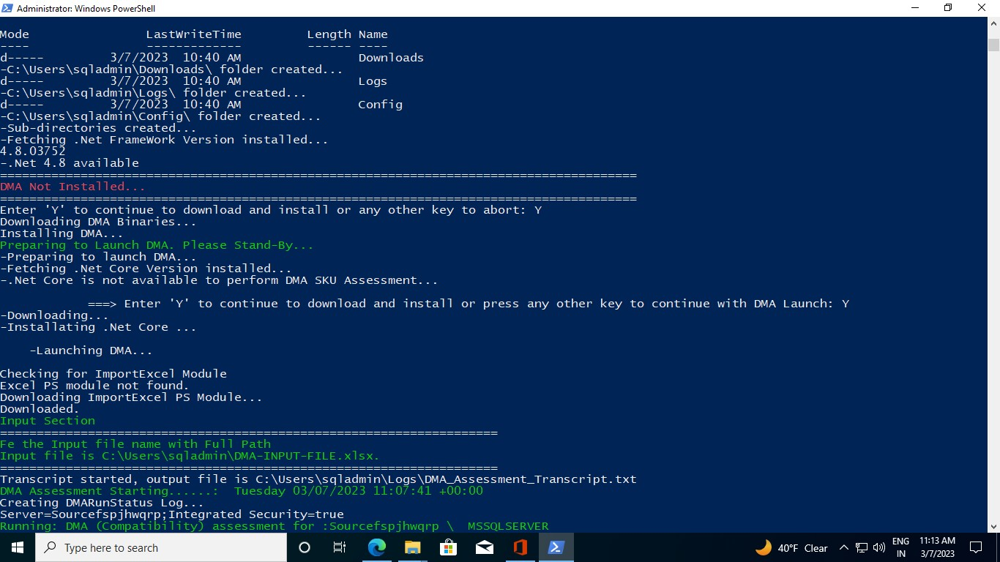

7. After all the requirements are installed, DMA assessment will run and it will bring up a pop up window where the DMA assessment and SKU performance results are available as shown below.

    

8. Press any key to continue.

    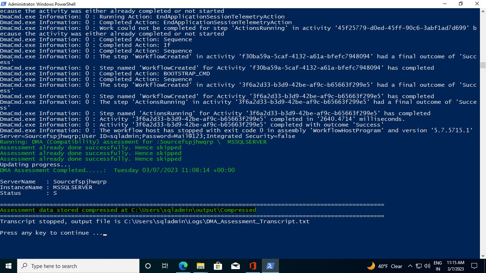

9. Again you need to run the script to Perform performance data gathering. In ```C:\Users\sqladmin``` path, right-click on ```SMF_DMAPreReqAssessCombo_V5.8.ps1``` script and select **Run with PowerShell** to run the script.

    

10. Give ```3``` as input value to select Perform performance data gathering.

    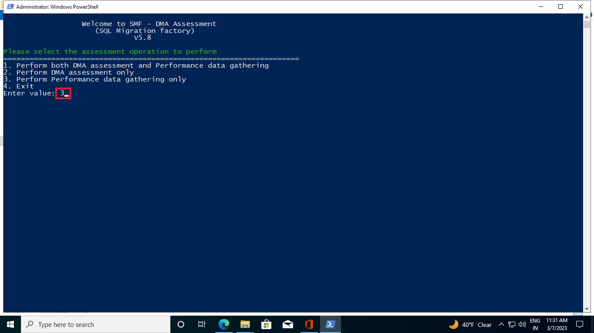

11. It will again check for all the prerequisites and ask for your input. Enter ```Y``` to continue performance data collection. 

    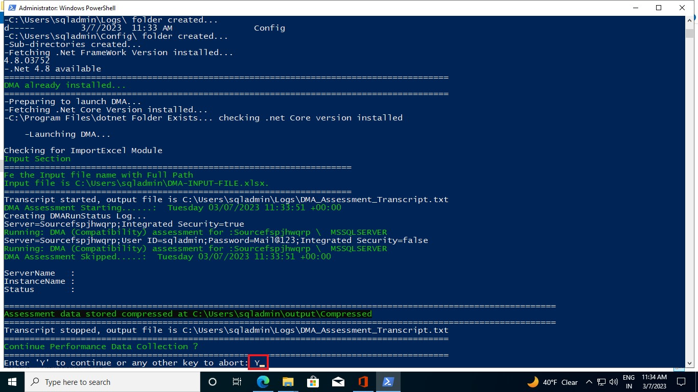

12. Upon entering ```Y``` the console will ask for two additional parameters:
   
   - Please Provide the Data Collection duration in Day/s – Here , please put any value between 0 to 15 .
> Note : There might be a situation where user may want to run this for less than 24 hours , in that situation user should put 0.

In the below example we put the day range as 2.

   
    
   - Next the console will ask Hour value (Please Provide the Data Collection duration Hours) – Here , please put any value between 0 to 23. And press enter.
> Note : If you put the Day value as 0 , please do not put the Hour value as 0 ( It should be anything between 1-23 )

In the below example we put the hour range as 1.

   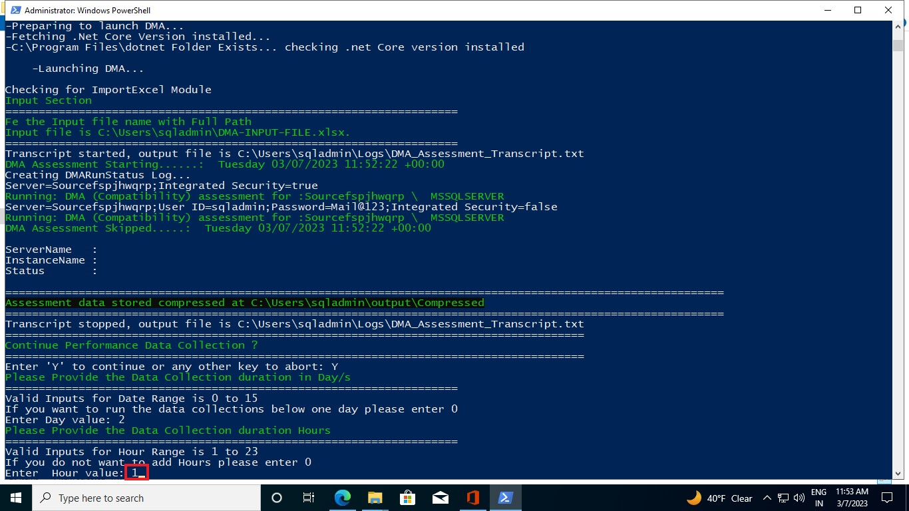

13. After that the process will initiate. The process will continue to run as per the time range provided by the user in the last step and terminate automatically (Note – User also can terminate the process by pressing enter key).

    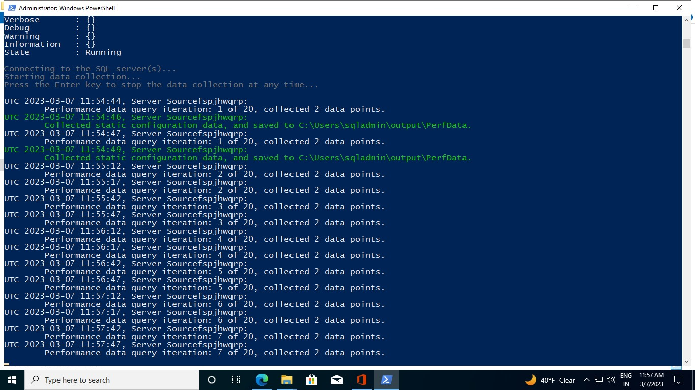

This will allow the performance data to be collected to select the best Azure SQL Database, SQL Managed Instance, or SQL Server on Azure VM target and SKU for your database. Database Migration Assistant (DMA) helps address these questions and make your database migration experience easier by providing these SKU recommendations. It is recommended that the performance data gathering is run for minimum four hours during the peak SQL Server workloads.

After running for a specific period of time, the process will stop executing on its own as per the Day/Hour values provided by the user, otherwise Press Enter Key in the window where the script is running.

14. Press enter after few minutes to terminate the process. It will bring up a pop up window where the DMA assessment and SKU performance results are available.

    
    
    
    
    
    
    
    
    
    
