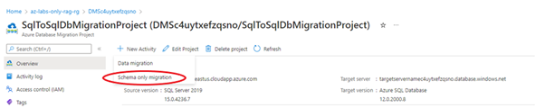
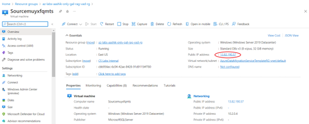
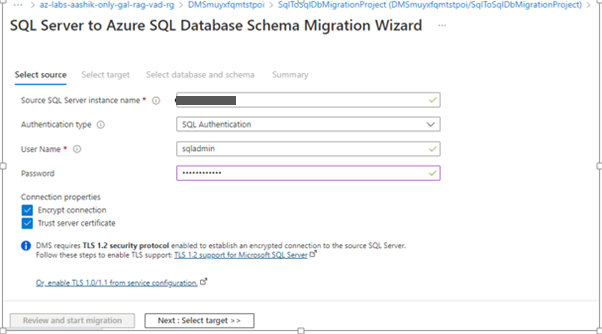
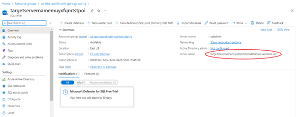
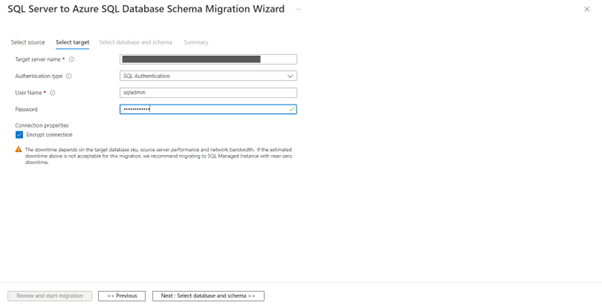
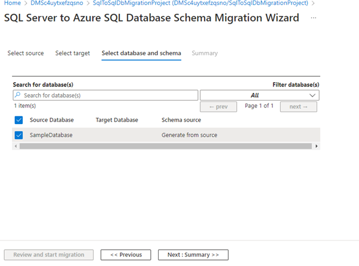
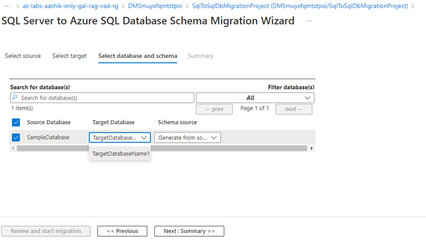
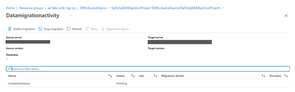
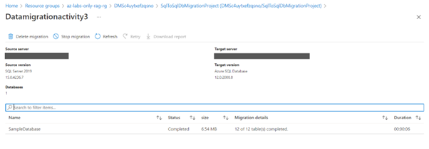

# Performing the Schema Migration

## Introduction

In this lab step you will perform the schema only migration from the source SQL Server instance to the target Azure SQL Database using Azure Data Migration Service.

## Instructions

1. In the Azure portal menu, select **All services**. Search for and select **Azure Database Migration Service**.

2. On the **Azure Database Migration Service** screen, select the Azure Database Migration Service instance created for you.

    

3. Select **SqlToSqlDbMigrationProject**.

4. Then Select **+ New Activity**.

    
    
5. Select **Schema only migration**.

## Specify source details

1. On the **Select source** screen, you will specify the connection details for the source server instance.

2. Provide the Source SQL Server Instance Name with the above source VM's **Public IP Address**: 20.237.235.148

    

3. Enter **SQL Username**: sqladmin and **Password**: Password@123 and ensure **Trust server certificate** is checked. **Encrypt connection** can be checked or unchecked (checked is recommended in production):

    
    
4. Select **Next: Select databases**.

## Select databases for migration

Select either all databases or specific databases that you want to migrate to Azure SQL Database. DMS provides you with the expected migration time for selected databases

1. Choose the database(s) you want to migrate from the list of available databases.

2. Review the expected downtime. If it's acceptable, select **Next: Select target**.

## Specify target details

1. On the **Select target** screen, provide authentication settings to your Azure SQL Database.

2. Provide the **Target Server Name**: targetservernamesjlkt4djbbjr4.database.windows.net

    
    
3. Provide **SQL Username**: sqladmin and **Password**: Password@123 

    
    
4. Select **Next: Select database and schema**.

    
    
5. Select Target database as **TargetDatabaseName1**.

    

6. Select Schema source as **Generate from Source**.

    

7. Select Next: Summary, review the migration configuration and in the Activity name text box, specify a name Schemaonlymigrationactivity for the migration activity. 

    
    
## Run the migration

1. Select **Start migration**. The migration activity window appears, and the **Status** of the activity is **pending**.

    

## Monitor the migration

1. On the migration activity screen, select Refresh to update the display until the Status of the migration shows as Completed.

    
