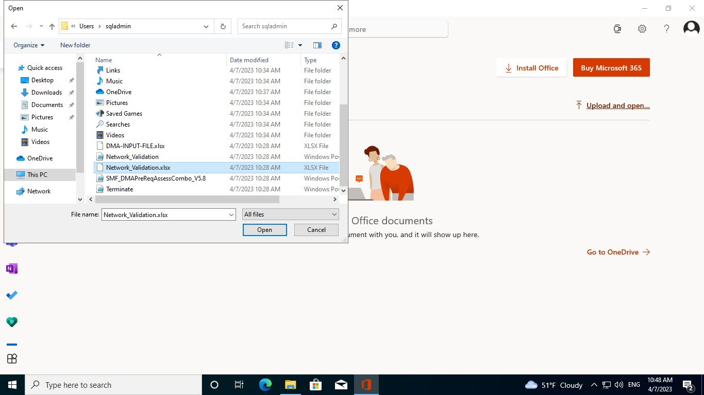

# Network Validation

## Learning Objectives

This lab step is to provide the detailed procedure/step to use the Network Validation script (Network_Validation.ps1) to perform the following basic checks on target SQL environmnent:
- Check for target server IP address
- Check for network diagnostics
- Check for firewall settings
- Check for infrastructure validation
- Check connection w.r.t port and server
- Check diskspace

## Prerequisites

- Virtual Machine - Already setup for you.
- ImportExcel and Az module  
- Input Excel File - The Network Validation script is based on the worksheet named ‘Network_Validation.xlsx’

## Exercise 1: Connecting to virtual machine via RDP

1. Go to **Azure portal** and click on hamburger button ☰ on top-left side and select **Resource groups**. Select the resource group deployed in the Azure Portal. Amongst the list of resources, open the **virtual machine** starting with name ```DMA```.

    
    
    
    
    

2. Click on **Connect** and then click **Select** to connect via native RDP. Click **Download RDP file** to download.

    
    
    
    
    

3. File will be downloaded inside **Downloads** folder in your local system. Open the RDP file. Then select **Connect**.

    
    
    

4. Click on **More choices** and then select **Use a different account**. Enter ```sqladmin``` as Email address and ```Mail@123``` as Password. Click **Ok**. And Select **Yes** to verify the certificate.
    
    
    
    
    
    
    
    

5. Now you are inside the **virtual machine**.

    

## Exercise 2: Copying powershell scripts and input excel file for DMA assessment

1. Click on **File Explorer** present in Taskbar at the bottom. Go to ```C:\Packages\Plugins\Microsoft.Compute.CustomScriptExtension\1.10.15\Downloads\0``` path. This folder contains ```Network_Validation.xlsx``` and ```Network_Validation.ps1``` files.

    
    
    

2. Select these files and right-click on the mouse and select **Copy** or press **Ctrl + C**.

    

3. Now go to ```C:\Users\sqladmin``` path and right-click on the mouse and select **Paste** or press **Ctrl + V** to paste the files in this folder.

    
    
## Exercise 3: Preparing the Input excel file

1. Search for ```Office``` in the **Search bar** at the bottom and click **Open**.

    

2. Click **Sign in** and sign into **MS office** using your lab credentials.

    

3. Select **Excel** and then click **Upload and open...** option. Browse to ```C:\Users\sqladmin``` path and select ```Network_Validation.xlsx``` file and select **Open**. It will be opened in the Microsoft Edge browser.

    
    
    

4. This is the sample input file. You need to edit the contents of the excel file and make sure the input values are correct.

10. Once the input file is prepared, Select **File** at top-left side and then **Save As** and click **Download a copy**. 

    

11. Open **File explorer** and Go to **Downloads** folder and select ```DMA-INPUT-FILE.xlsx``` file and right-click on the mouse and select **Copy** or press **Ctrl + C**. Now go to ```C:\Users\sqladmin``` path and right-click on the mouse and select **Paste** or press **Ctrl + V** to replace the existing file. Please make sure that the file name should not be changed.

    
    
    

## Exercise 4: Runing DMA assessment powershell script

1. In ```C:\Users\sqladmin``` path, right-click on ```Network_Validation.ps1``` script and select **Run with PowerShell** to run the script.

    

2. Now **Windows powershell** will open and ask for your input.

    
