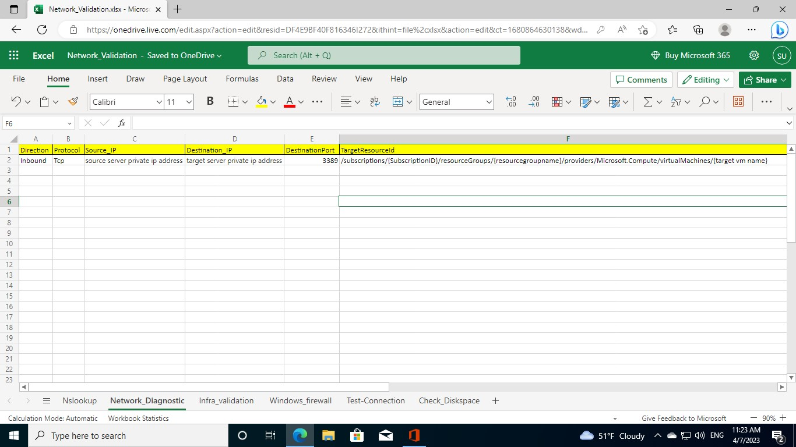
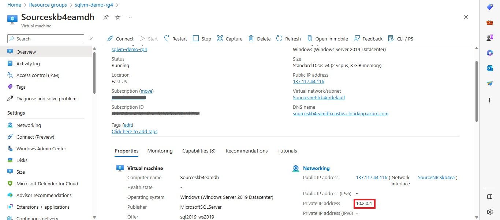
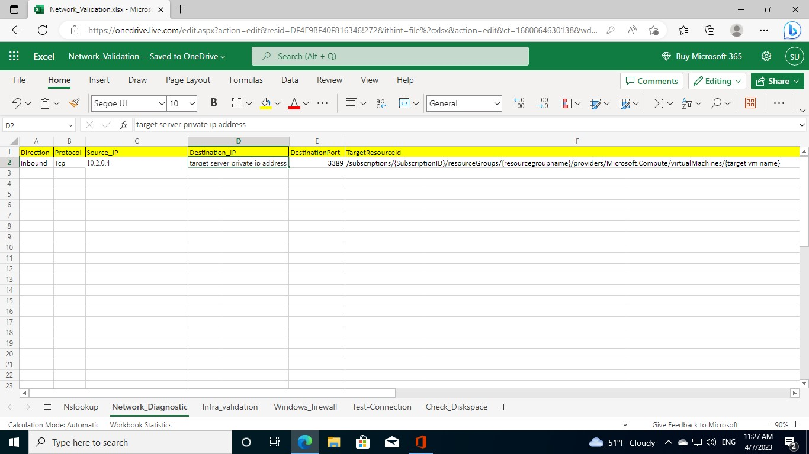
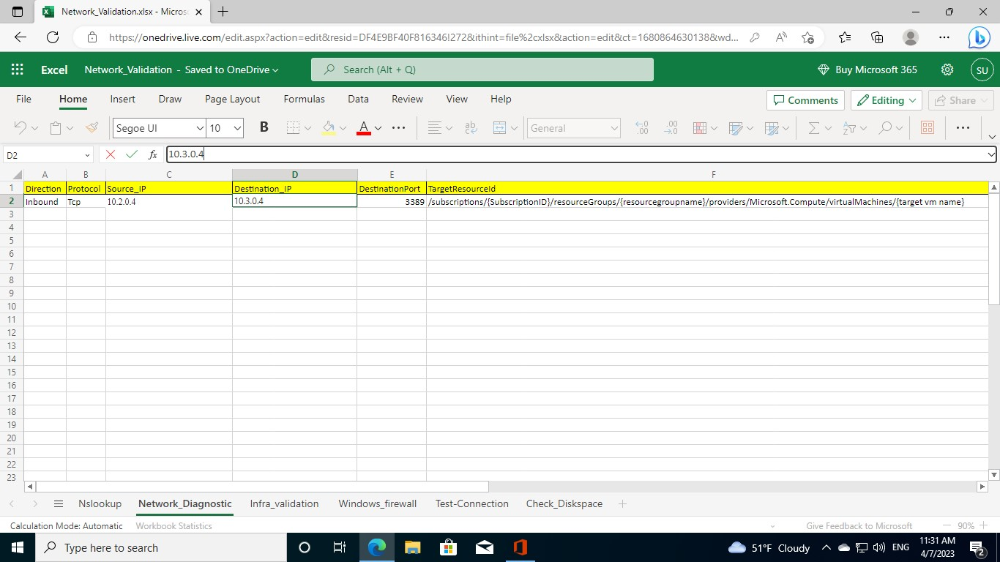
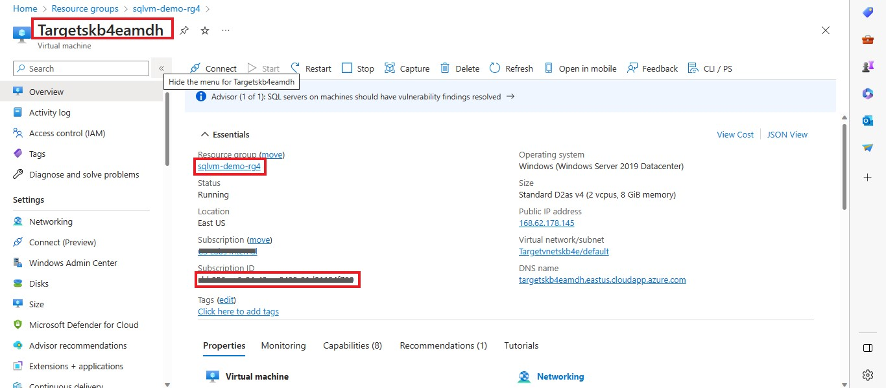
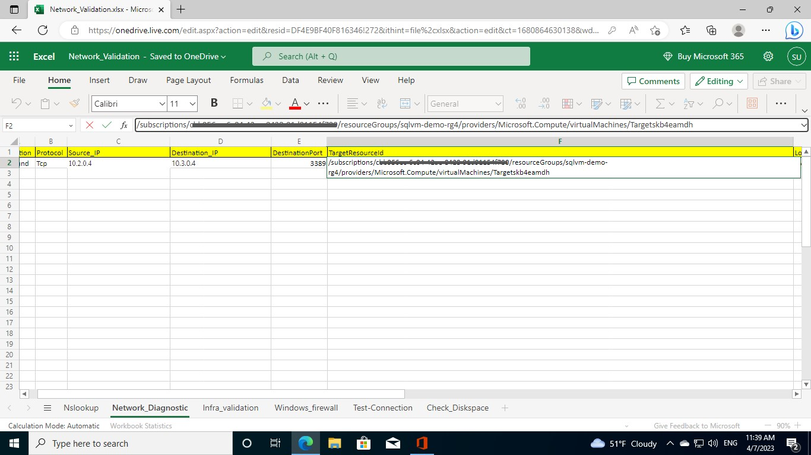
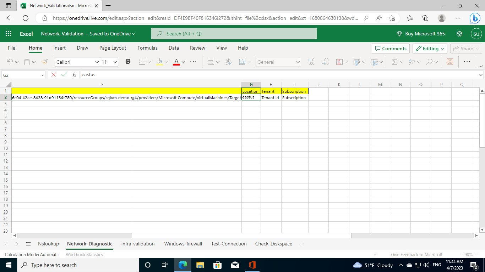
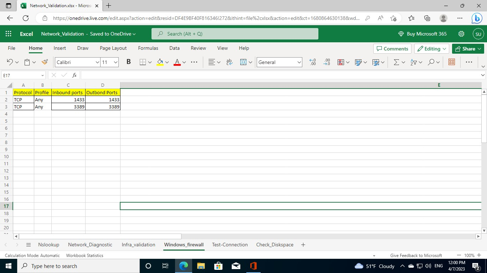

# Network Validation

## Learning Objectives

This lab step is to provide the detailed procedure/step to use the Network Validation script (Network_Validation.ps1) to perform the following basic checks on target SQL environmnent:
- Check for target server IP address
- Check for network diagnostics
- Check for firewall settings
- Check for infrastructure validation
- Check connection w.r.t port and server

## Prerequisites

- Virtual Machine - Already setup for you.
- ImportExcel and Az module  
- Input Excel File - The Network Validation script is based on the worksheet named ```Network_Validation.xlsx```

## Exercise 1: Connecting to virtual machine via RDP

1. Go to **Azure portal** and click on hamburger button ☰ on top-left side and select **Resource groups**. Select the resource group deployed in the Azure Portal. Amongst the list of resources, open the **virtual machine** starting with name ```DMA```.

    
    
    
    
    

2. Click on **Connect** and then click **Select** to connect via native RDP. Click **Download RDP file** to download.

    
    
    
    
    

3. File will be downloaded inside **Downloads** folder in your local system. Open the RDP file. Then select **Connect**.

    
    
    

4. Click on **More choices** and then select **Use a different account**. Enter ```sqladmin``` as Email address and ```Password@123``` as Password. Click **Ok**. And Select **Yes** to verify the certificate.
    
    
    
    
    
    
    
    

5. Now you are inside the **virtual machine**.

    

## Exercise 2: Copying powershell scripts and input excel file for basic target server network validation

1. Click on **File Explorer** present in Taskbar at the bottom. Go to ```C:\Packages\Plugins\Microsoft.Compute.CustomScriptExtension\1.10.15\Downloads\0``` path. This folder contains ```Network_Validation.xlsx``` and ```Network_Validation.ps1``` files.

    
    
    

2. Select these files and right-click on the mouse and select **Copy** or press **Ctrl + C**.

    

3. Now go to ```C:\Users\sqladmin``` path and right-click on the mouse and select **Paste** or press **Ctrl + V** to paste the files in this folder.

    
    
## Exercise 3: Preparing the Input excel file

1. We need **Excel** to edit the input excel file. Since **CloudAcademy** lab credentials don't have license to MS office. Please use your Microsoft account to use MS office for editing.

2. Search for ```Office``` in the **Search bar** at the bottom and click **Open**.

    

3. Click **Sign in** and sign into **MS office** using your Microsoft account credentials if you're not signed in. (You have already signed-in in the previous lab step)

    
    
    **Note: If you are not able to login with your Microsoft account credentials, Please copy-paste the file to your local machine and make the changes and again copy-paste into the virtual machine.**

4. Select **Excel** and then click **Upload and open...** option. Browse to ```C:\Users\sqladmin``` path and select ```Network_Validation.xlsx``` file and select **Open**. It will be opened in the Microsoft Edge browser.

    
    
     

5. This is the sample input file. You need to edit the contents of the excel file and make sure the input values are correct and not prefixed/suffixed with any special characters/whitespaces while copy-pasting to excel file**.

    

6. Open **Nslookup** worksheet. Go to **Azure Portal** opened in your local machine and open the **Resource group**. Open the **Virtual machine** starting with ```Target{*}```. Copy the **DNS name** and Paste it in the field **target server dns name**.

     
    
    

7. Open **Network_Diagnostic** worksheet. 

     
    
    Go to **Azure Portal** opened in your local machine and open the **Resource group**. Open the **Virtual machine** starting with ```Source{*}```. Copy the **Private IP address** and Paste it in the field **source server private ip address**.
    
    
    
    
    
    Go to **Azure Portal** opened in your local machine and open the **Resource group**. Open the **Virtual machine** starting with ```Target{*}```. Copy the **Private IP address** and Paste it in the field **target server private ip address**.

    
    
    
    
    Go to **Azure Portal** opened in your local machine and open the **Resource group**. Open the **Virtual machine** starting with ```Target{*}```. Copy the **Subscription ID**, **Resource group name** and **Target VM name**. And Paste it in the respective placeholders ```/subscriptions/{SubscriptionID}/resourceGroups/{resourcegroupname}/providers/Microsoft.Compute/virtualMachines/{target vm name}```.

    
    
    

    Go to **Azure Portal** opened in your local machine and open the **Resource group**. Open the **Virtual machine** starting with ```Target{*}```. Copy the **Location** and Paste it in the field **location**. 
    Note : **Location** should be in small case letters without any whitespaces. For ex: ```East US``` should be ```eastus```, ```West US 2``` should be ```westus2```.

    
    
    

    Go to **Azure Portal** opened in your local machine and search for **Azure Active Directory** and open it. Copy the **Tenant ID** and Paste it in the field **Tenant id**.

    
    
    

    Go to **Azure Portal** opened in your local machine and open the **Resource group**. Open the **Virtual machine** starting with ```Target{*}```. Copy the **Subscription ID** and Paste it in the field **Subscription**.

    
    
    
    
8. Open **Infra_validation** worksheet. Copy-Paste the **Resource group name**, **Target VM name**, **Tenant ID** and **Subscription ID** you copied earlier into the respective fields.

    
    
9. Open **Windows_firewall** worksheet. Keep the values default.

    

10. Open **Test-Connection** worksheet. Copy-Paste the **DNS name** of the Target VM into the field **target server dns name**.

    

11. Once the input file is prepared, Select **File** at top-left side and then **Save As** and click **Download a copy**. 

    

12. Open **File explorer** and Go to **Downloads** folder and select ```Network_Validation.xlsx``` file and right-click on the mouse and select **Copy** or press **Ctrl + C**. Now go to ```C:\Users\sqladmin``` path and right-click on the mouse and select **Paste** or press **Ctrl + V** to replace the existing file. Please make sure that the file name should not be changed.

    
    
    
    
## Exercise 4: Runing target server network validation powershell script

1. In ```C:\Users\sqladmin``` path, right-click on ```Network_Validation.ps1``` script and select **Run with PowerShell** to run the script.

    

2. Now **Windows powershell** will open and script will run. Creates the required folders and installs **ImportExcel** and **Az** modules. Please wait for 2-3 minutes.

    

3. Enter ```1``` for Validation of the IP adress.

    
    
    
    
4. Enter ```2``` for Checking inbound and outbound rules of firewall.

    
    
    
    
5. Enter ```3``` for Test connection w.r.t target vm and port.

    
    
    
    
6. Enter ```4``` for Checking Network diagnostics. Popup window will appear. Please login with your lab credentials.

    
    
    
    
    
    
    
    
7. Enter ```5``` for Infrastructure validation. Popup window will appear. Please login with your lab credentials.

    
    
    
    
    
    
    
    
    In the output, you can see that ```VM_SKU``` is **Standard_D2as_v4**. You can compare it with the recommended compute size from SKU recommendation report generated in the previous lab step.
    
    
   
9. Enter ```6``` to Exit. An Excel file will be created with all the information in ```C:\Users\sqladmin\Output``` folder.
